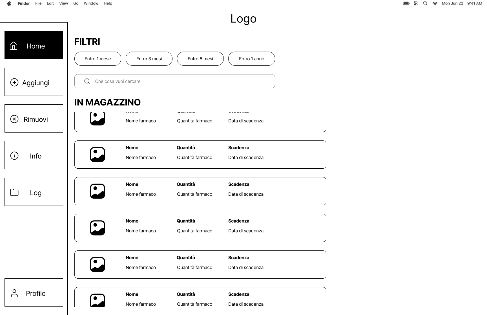
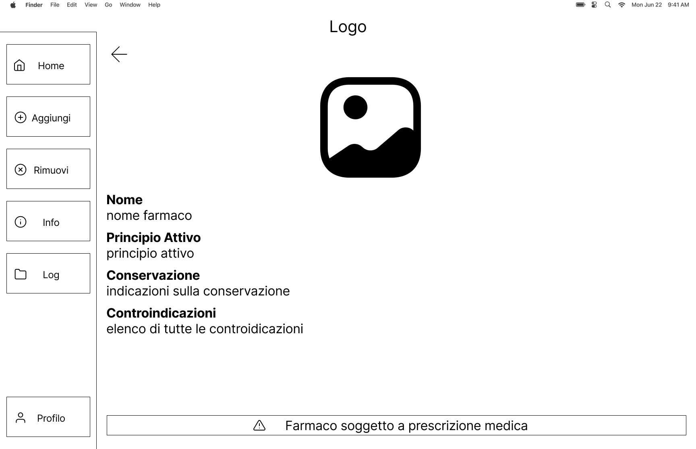
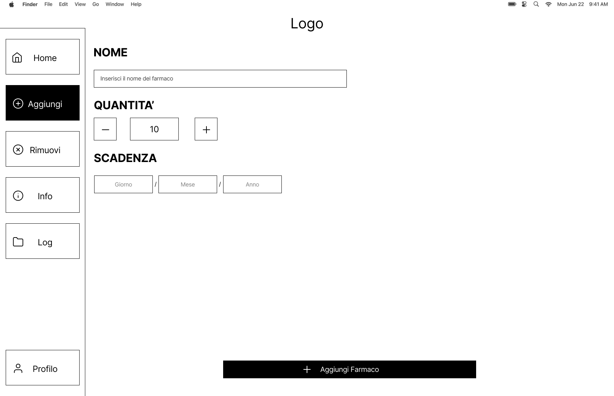

# Project Name
FarmaLab

# Paper Prototype
Abbiamo deciso di sviluppare in modo più approfondito le schermate di Home e di Aggiunta di un farmaco, perché riteniamo che siano quelle che l’utente utilizzerà più frequentemente nell’esperienza quotidiana con il sistema. Questa scelta nasce da una valutazione condivisa all’interno del gruppo, basata sull’analisi dei flussi principali di utilizzo. 
La Home rappresenta infatti il punto di partenza e di controllo generale, mentre la schermata di aggiunta è il cuore operativo del gestionale, dove avviene l’inserimento dei farmaci. Concentrarci su queste due sezioni ci ha permesso di progettare con maggiore attenzione le funzionalità più importanti, rendendo l’interazione più semplice, rapida ed efficace per l’utente finale.

La figura che vediamo sopra rappresenta la schermata di Home del nostro sistema. In questa sezione l’utente può visualizzare tutti i farmaci che sono stati inseriti, avendo così una panoramica immediata e ordinata della situazione del magazzino. 
Rispetto al low-fidelity prototype, abbiamo scelto di apportare alcune modifiche per migliorare la chiarezza dell’interfaccia. In particolare, abbiamo aggiunto due titoli, “Filtri” e “In magazzino”, con l’obiettivo di rendere più comprensibile la funzione delle varie aree della schermata e ridurre al minimo possibili ambiguità. Questo intervento ci ha permesso di migliorare la leggibilità dell’interfaccia e di rendere l’esperienza dell’utente più intuitiva e immediata.

Durante la fase di test dei nostri prototipi a bassa fedeltà, ci siamo resi conto che una funzionalità particolarmente interessante poteva essere quella di permettere all’utente, semplicemente cliccando su una card presente nella Home, di accedere direttamente alla schermata di eliminazione del farmaco selezionato. 
Questa scelta progettuale nasce dall’esigenza di rendere l’interazione più rapida e immediata, riducendo il numero di passaggi necessari per compiere un’operazione frequente. In questo modo l’utente può agire in modo più pratico ed efficiente, migliorando sensibilmente l’esperienza d’uso complessiva del sistema.

Sempre grazie all’interazione con i prototipi a bassa fedeltà, ci siamo resi conto che, nel momento in cui l’utente accede alla schermata di rimozione di un farmaco, potrebbe essere molto utile avere sotto controllo anche i dettagli del prodotto che sta per eliminare. 
Da questa osservazione è nata l’idea di inserire un’icona informativa in alto a destra, che permetta all’utente di tornare rapidamente alla schermata con tutte le informazioni del farmaco selezionato. In questo modo l’utente può verificare i dati prima di compiere l’azione, evitando errori e rendendo l’operazione complessivamente più pratica, sicura e intuitiva.

Infine arriviamo alla schermata di aggiunta di un prodotto. In questo caso, dal confronto e dall’iterazione continua all’interno del nostro gruppo, ci siamo resi conto che la struttura pensata inizialmente funzionava già in modo efficace e non presentava particolari criticità. 
Per questo motivo abbiamo scelto di non apportare modifiche rilevanti: il mockup low-fidelity risulta infatti molto simile al mockup medium-fidelity. Questo passaggio ci ha confermato che le scelte progettuali iniziali erano coerenti e ben allineate con le esigenze dell’utente, permettendoci di concentrarci su altri aspetti dell’interfaccia.
# Figma Link
[Lasciamo il link per poter accedere alla prototipazione realizzata in figma](https://www.figma.com/proto/QrxU47AMCp5al1BPuWkwE4/FarmaLab?page-id=1%3A2&node-id=7-181&viewport=445%2C459%2C0.26&t=GVTFcT2tezXDDtk8-1&scaling=scale-down&content-scaling=fixed&starting-point-node-id=7%3A181)